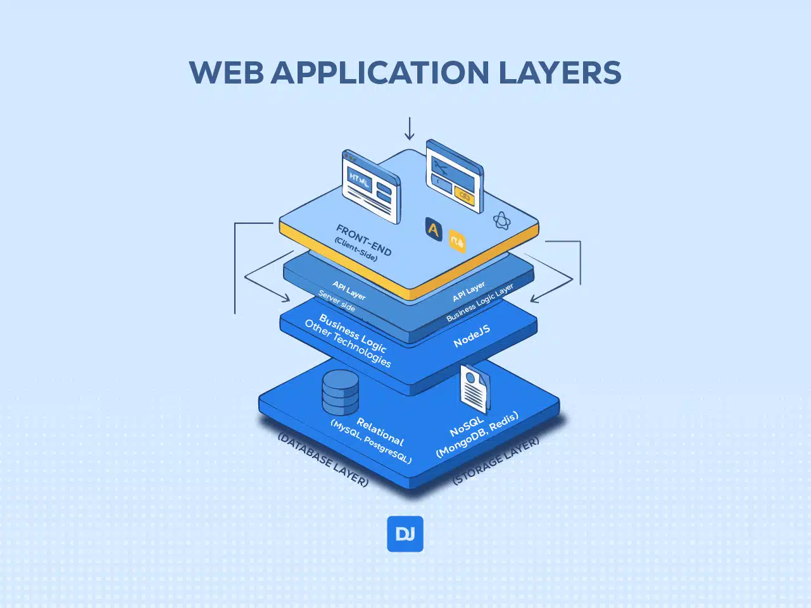

---
# https://marpit.marp.app/markdown
marp: true
title: Fullstack
description: A comprehensive guide to full-stack development, covering both front-end and back-end technologies, as well as essential tools and skills for modern web development.
author: jsa4000
theme: dark
paginate: true
headingDivider: 0
class:
  - lead
  - invert
header: FullStack Development
footer: © 2026 Javier Santos - All rights reserved
---

<!--
_paginate: skip
_header: ""
_footer: ""
_class: title
-->

# FullStack Development

## A comprehensive guide to full-stack development


---

<!-- backgroundImage: "linear-gradient(to bottom, #000000, #222021)" -->

## Full-Stack Development


**Full-Stack Development** is the process of developing a web application on both the **client-side** (**front-end**) and **server-side** (**back-end**). A Full-Stack Developer is proficient in all layers of web development, enabling them to handle a project from concept to production.

Full-stack isn’t tied to a **specific** tech stack; it refers to any development that covers both front-end and back-end. In fact, `MEAN` and `MERN` are subsets of full-stack development; they are full-stack technology combos.

---




## Front-end (Client-Side)

This is the user-facing layer, built using technologies that run in the user’s browser. It handles the user interface (UI) and user experience (UX).

---

## Client-Side Frameworks (UI & State)

These run primarily in the user's browser to create interactive user interfaces.

- **React**: Developed by Meta, it is technically a library focused on building reusable UI components using a "Virtual DOM" for efficient updates. It is widely adopted and has a massive ecosystem of third-party tools.
- **Angular**: A comprehensive, "batteries-included" framework by Google. It uses TypeScript by default and provides built-in solutions for routing, forms, and state management, making it a standard for large-scale enterprise applications.
- **Svelte**: Unlike React or Angular, Svelte is a compiler. It shifts work from the browser to a build step, resulting in highly optimized, "vanilla" JavaScript with minimal runtime overhead and excellent performance.

---

<style>
section {
  font-size: 24px;
}
</style>


## Backend (Server-Side)

The Back-end is the engine of the application, handling business logic, user authentication, and serving data to the frontend. It consists of three sub-layers:

1. **API Layer**: Receives requests from the frontend (via HTTP) and sends responses.
2. **Business Logic Layer**: The core processing logic that determines the application’s functionality.
3. **Other Technologies**: Server-side languages (Node.js, Python, Java, PHP) and frameworks (Express.js, Django, Ruby on Rails).

---

## Server-Side Frameworks (Backend & APIs)

These run on a server or at the "edge" to handle data, authentication, and API requests.

- **Express**: The industry veteran for Node.js. It is a minimalist, unopinionated framework that gives developers total freedom to structure their applications as they see fit.
- **NestJS**: An enterprise-grade framework built on top of Express (or Fastify). It enforces a modular architecture inspired by Angular, utilizing decorators and dependency injection to keep large codebases maintainable.
- **Hono**: A modern, ultrafast framework designed specifically for "Edge" runtimes like Cloudflare Workers, Bun, and Deno. It is extremely lightweight (under 14kB) and uses standard Web APIs for maximum speed.

---

## Full-Stack & Specialized Frameworks

These often bridge the gap between frontend and backend, offering specialized rendering strategies.

- **Next.js**: The most popular React-based full-stack framework. It simplifies complex features like Server-Side Rendering (SSR), Static Site Generation (SSG), and API routes, making it the standard for production-ready React apps.
- **Astro**: A "framework-agnostic" tool designed for content-heavy sites (like blogs or documentation). It uses an "Islands Architecture" to ship zero JavaScript by default, only hydrating interactive parts of the page.
- **TanStack**: While best known for TanStack Query (data fetching), this ecosystem has expanded into TanStack Start, a full-stack framework designed to provide a highly type-safe, developer-friendly alternative to Next.js.

---


### Database (Storage Layer)

A database is responsible for persistent data storage, retrieval, and management.

Technologies: Relational databases (MySQL, PostgreSQL) or NoSQL databases (MongoDB, Redis).

## Stacks

### MEAN vs MERN

## SSR (Server-Side Rendering) vs SSG (Static Site Generation) vs CSR (Client-Side Rendering)

---

## Server Components

<div class="columns">
<div class="columns-left">

### Column 1

Content 1

```yaml
marp: true
style: |
  .columns {
    display: grid;
    grid-template-columns: repeat(2, minmax(0, 1fr));
    gap: 1rem;
  }
  .columns-left {
    background: yellow;
  }
  .columns-right {
    background: beige;
  }
```

</div>
<div class="columns-right">

### Tantask Start

In tanstack start, you can create server components by adding the `.server.tsx` extension to your component files. These components will only run on the server and can access server-side resources like databases or APIs without exposing them to the client.

```ts
import CardDemo from "@/components/card-demo";

export default function Home() {
  return (
    <CardDemo />
  );
}
```

</div>
</div>

---

## Server Actions

---

# Full‑Stack Evolution & Modern Rendering

**From HTML → HTML5 → React/Next.js — rendering strategies and modern server features**


<!-- Speaker notes: 30s — Welcome, introduce topic and goals. Explain audience level (beginners) and duration (45–60 minutes). Mention Q&A at the end. -->

---

## Agenda

- Evolution timeline (HTML → frameworks)
- Rendering strategies: CSR, SSR, SSG, ISR
- Modern server techniques: Server Components, Server Actions, streaming
- Examples, performance checklist, further reading

<!-- Speaker notes: 45–60s — Walk through agenda. Explain we will use analogies and short code snippets (non-runnable). -->

---

## Why Rendering Matters

- Perceived speed (first paint vs. interactivity)
- SEO & discoverability (search engines, social previews)
- Developer trade-offs: complexity, cost, and maintainability

<!-- Speaker notes: 1m — Use an analogy: pages are like restaurant meals — first sight (LCP) vs. how fast you can actually eat (TTI). Different rendering strategies change both plating and preparation. -->

---

## Quick Timeline

- Static HTML pages (early web)
- HTML5 + browser APIs (fetch, history, SW)
- SPA era (heavy client JS)
- Hybrid frameworks & return to server rendering

<!-- Speaker notes: 1m — Give a one-line history explaining why frameworks emerged: interactivity and app-like experiences demanded richer client logic. -->

---

## Static HTML (Early Web)

- File-based pages served as-is from the host
- Pros: simple, fast on CDN, secure surface area
- Cons: limited interactivity, manual updates

<!-- Speaker notes: 45s — Mention examples: early blogs, static company sites. Great for content that rarely changes. -->

---

## Classical Server-Side Rendering (SSR)

- Templates render HTML per-request (PHP, Rails)
- Pros: good SEO, fast first paint, server has full context
- Cons: server load per request, longer time-to-interactive for heavy clients

<!-- Speaker notes: 1m — Emphasize how SSR outputs complete HTML on each request and how that helps crawlers and low-powered devices. -->

---

## Client-Side Scripting & Progressive Enhancement

- Add JS to enhance UX while preserving baseline HTML
- Compatible and accessible approach
- Often under-appreciated in SPA-first thinking

<!-- Speaker notes: 1m — Explain progressive enhancement: serve good HTML first, layer JS for richer behaviors. This improves resilience and accessibility. -->

---

## HTML5 & Browser APIs (Why the Browser Got Smarter)

- Fetch, History API, Modules, Service Workers
- Enabled offline, routing, finer-grained network control

<!-- Speaker notes: 45s — Quick recap of modern browser primitives that made client features easier and more robust. -->

---

## SPA Era: React / Vue / Angular

- Single bundle boots the app, client routing, virtual DOM
- Pros: rich interactivity and fluid UIs
- Cons: initial load cost, SEO/workarounds required

<!-- Speaker notes: 1m — Describe why SPAs were attractive: developer ergonomics and single-language apps. Mention solutions that mitigated drawbacks (pre-rendering, SSR). -->

---

## Rendering Strategies (Overview)

- CSR: Client-Side Rendering — app boots in the browser
- SSR: Server-Side Rendering — HTML built per-request
- SSG: Static Site Generation — HTML built at build time
- ISR: Incremental Static Regeneration — hybrid regeneration on demand

<!-- Speaker notes: 45s — One-line when-to-use guidance for each strategy. We'll deep-dive next. -->

---

## CSR Deep Dive

- Browser downloads JS, mounts app, fetches data client-side
- Great for highly interactive apps where SEO is not critical
- Watch out for bundle size and TTI impact

<!-- Speaker notes: 1m — Example use-cases: dashboards, complex editors, internal apps. Mention code-splitting & lazy loading. -->

---

## SSR Deep Dive

- Server renders full HTML per request; client hydrates for interactivity
- Pros: fast LCP, better SEO, simpler initial UX
- Cons: server cost, potential latency, complexity with streaming

<!-- Speaker notes: 1m — Explain how hydration works: server HTML + client JS attach event handlers and state. -->

---

## SSG Deep Dive

- Pages rendered at build time and served from CDN
- Pros: blazing fast, low server cost, simple caching
- Cons: rebuilds required for fresh data, not ideal for per-user pages

<!-- Speaker notes: 45s — Use example: marketing pages, docs, blogs. Mention incremental approaches (ISR). -->

---

## ISR (Incremental Static Regeneration)

- Hybrid: serve static pages, regenerate on demand or on interval
- Best for mostly-static sites that occasionally change (product pages)

<!-- Speaker notes: 1m — Explain how ISR reduces rebuild pain by regenerating only stale pages. Great for scale. -->

---

## Hydration Explained

- Server sends HTML; client-side JS "hydrates" to add interactivity
- Cost: parse + execute JS, re-run render logic in browser

<!-- Speaker notes: 1m — Analogy: hydration is like topping a cake that was baked on the server — you add interactive decorations in the browser. Explain cost reasons and how to reduce it. -->

---

## Hydration Strategies

- Progressive / Partial Hydration — hydrate only needed parts
- Islands Architecture — isolate interactive components
- Deferred hydration & lazy-loading heavy components

<!-- Speaker notes: 1m — Mention projects and patterns: Astro (islands), partial hydration experiments, client:idle hydration triggers. -->

---

## Streaming & Progressive Rendering

- Stream HTML from server in chunks so above-the-fold arrives first
- Improves perceived performance and LCP

<!-- Speaker notes: 1m — Mention Node streaming, React 18 streaming server renderer, and difference between streaming HTML and full hydration. -->

---

## Edge Rendering & CDNs

- Render near users (edge functions) to reduce latency
- Trade-offs: cold starts, limited runtime, smaller memory

<!-- Speaker notes: 45s — Explain where edge makes sense: personalization at the edge, geodistributed compute for lower latency. -->

---

## Server Components (Concept)

- Server-only UI pieces rendered as HTML on server
- Reduces client JS because heavy logic stays server-side
- Compose with client components for interactivity

<!-- Speaker notes: 1m — High-level view: Server Components are not a replacement for SSR, but a composition model to minimize client code. Mention React Server Components as example. -->

---

## Server Actions (Concept)

- Server-side functions invoked from UI (no separate API endpoint)
- Simplifies form handling and side-effects securely on server

<!-- Speaker notes: 1m — Describe how server actions let you run mutations on the server without client-side fetch boilerplate. Great for security and simplicity. -->

---

## Data Fetching Patterns & Caching

- Server fetch when you control secrets or need SSR
- Client fetch for optimistic UI and background refresh
- Caching: CDN, cache-control, SWR/stale-while-revalidate

<!-- Speaker notes: 1m — Provide guidance on choosing patterns and using cache headers and client cache libraries for UX. -->

---

## Security & Operational Concerns

- Keep secrets server-side; avoid embedding credentials in bundles
- Rate-limit APIs; validate inputs server-side; set CORS properly
- Observability: logs, metrics, tracing for SSR/edge functions

<!-- Speaker notes: 45s — Stress operational cost differences between SSR and SSG and why monitoring matters. -->

---

## Performance Checklist

- Measure: LCP, TTFB, TTI (or Interaction to Next Paint), CLS
- Reduce bundle size, code-split, lazy-load, defer non-critical JS
- Use CDN, enable caching, preconnect critical origins

<!-- Speaker notes: 1m — Quick prioritization: first optimize LCP/TTFB, then TTI. Use Lighthouse or WebPageTest for metrics. -->

---

## Example: Hydration (pseudo-code)

```html
<!-- server output -->
<div id="app"><!-- pre-rendered HTML here --></div>
<script src="/assets/app.bundle.js"></script>
<script>
  // client-side boot (pseudo)
  import("/assets/app.bundle.js").then(({ hydrate }) =>
    hydrate(document.getElementById("app")),
  );
</script>
```

<!-- Speaker notes: 1m — Explain timeline: HTML parsed -> first paint -> JS executes -> hydrate attaches event handlers and reuses markup. -->

---

## Example: SSR vs SSG (pseudo)

```js
// SSR (per-request)
app.get("/post/:id", async (req, res) => {
  const post = await db.getPost(req.params.id);
  res.send(renderToHtml(<Post post={post} />));
});

// SSG (build-time)
const posts = await fetchAllPosts();
for (const p of posts) {
  writeFile(`/out/post/${p.id}.html`, renderToHtml(<Post post={p} />));
}
```

<!-- Speaker notes: 1m — Emphasize trade-offs: SSR gives freshest data; SSG gives fastest edge delivery. -->

---

## Example: Minimal Server Component & Server Action (pseudo)

```jsx
// Server Component (pseudo)
export default async function PostServer({ id }) {
  const post = await db.getPost(id);
  return (
    <article>
      <h1>{post.title}</h1>
      <div>{post.body}</div>
    </article>
  );
}

// Server Action (pseudo)
export async function createComment(formData) {
  const text = formData.get("text");
  await db.insert({ text });
  return { ok: true };
}
```

<!-- Speaker notes: 1m — Clarify that server components run only on server and can access secrets; server actions are invoked from the client but execute on server. These are framework-specific conceptual patterns. -->

---

## Deployment & Hosting Options

- Static (CDN) — for SSG
- Serverless / Lambdas — for SSR/ISR
- Edge Functions — for low-latency personalization
- Traditional servers — full control and heavy compute

<!-- Speaker notes: 45s — Give quick recommendations and cost/operational trade-offs. -->

---

## Further Reading

- Next.js docs: https://nextjs.org/docs
- React Server Components RFC: https://github.com/reactjs/rfcs
- Astro: https://astro.build
- Articles: "The Cost of Hydration", "Islands Architecture"

<!-- Speaker notes: 30s — Suggest reading order: docs first, then deeper posts. -->

---

## Q&A

- Open for questions

<!-- Speaker notes: Remaining time — invite specific questions about hydration, SSR, or deployment. -->
