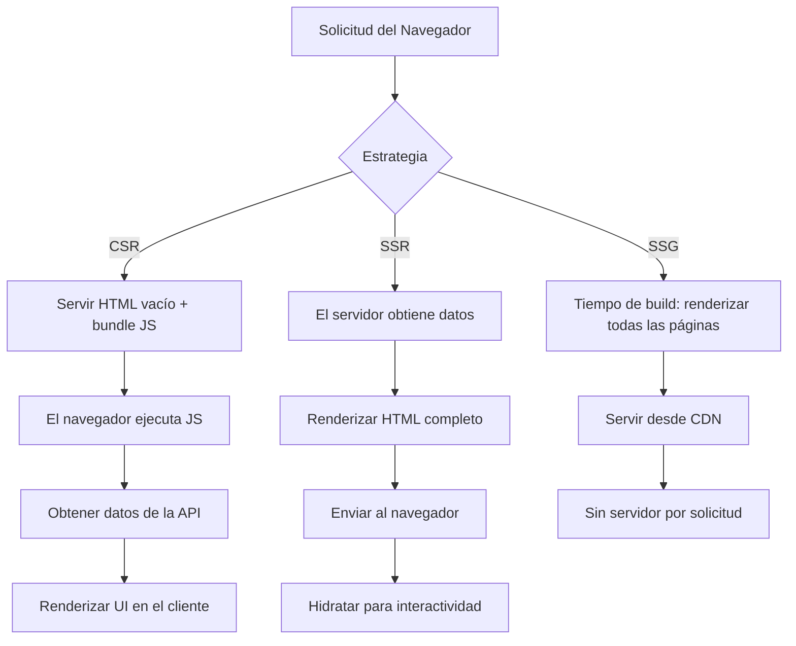

---
# https://marpit.marp.app/markdown
marp: true
title: Fullstack
description: Una guía completa para el desarrollo full-stack, que cubre tecnologías de front-end y back-end, así como herramientas y habilidades esenciales para el desarrollo web moderno.
author: jsa4000
theme: dark
paginate: true
headingDivider: 0
class:
  - lead
  - invert
header: Desarrollo FullStack
footer: © 2026 Javier Santos - Todos los derechos reservados
---

<!-- NOTE: Para exportar diagramas Mermaid, abre este archivo en VS Code con la extensión Marp para VS Code y usa "Export Slide Deck" → PDF o HTML. Los bloques Mermaid se renderizan mediante @mermaid-js/mermaid-core durante la exportación. -->

<!--
_paginate: skip
_header: ""
_footer: ""
_class: title
-->

# Desarrollo FullStack

## Una guía completa para el desarrollo full-stack


---

<!-- backgroundImage: "radial-gradient(ellipse at center, rgba(255,255,255,0.06) 0%, transparent 50%)" -->

## Historia de la Web

| Año      | Hito                                                        |
| -------- | ----------------------------------------------------------- |
| **1991** | HTML estático — Tim Berners-Lee crea la Web                 |
| **1995** | JavaScript y PHP — comienzan las páginas dinámicas          |
| **2005** | Ajax y Web 2.0 — apps asíncronas impulsadas por el usuario  |
| **2009** | Node.js — JavaScript en el servidor                         |
| **2015** | React y ES6 — era de SPA, interfaces basadas en componentes |
| **2019** | Jamstack — emergen Next.js, Nuxt y SvelteKit                |
| **2026** | Desarrollo asistido por IA — React Server Components, Edge  |

---

## El Desarrollador Fullstack

<div class="columns">
<div class="columns-left">

### Profundidad (Especialización)

- JavaScript / TypeScript
- Angular / React / Vue (modelo de componentes)
- Node.js / Express / NestJS / Hono
- Bases de datos SQL y NoSQL
- REST / GraphQL / tRPC

</div>
<div class="columns-right">

### Amplitud (Forma de T)

- Git, pipelines de CI/CD
- Docker y despliegue en la nube
- Seguridad básica (auth, HTTPS, CORS)
- Fundamentos de UX y accesibilidad
- Observabilidad (logs, métricas, trazabilidad)

</div>
</div>

---

## ¿Qué significa "Fullstack"?

<div class="columns">
<div class="columns-left">

**Web Tradicional**

- El servidor renderiza HTML, el navegador lo muestra
- Un solo código: plantillas + lógica de backend
- Ejemplos: PHP / Rails / Django

**API + UI**

- El backend expone una API REST / GraphQL / tRPC
- El frontend (React/Vue) la consume
- Despliegues separados, contratos compartidos

</div>
<div class="columns-right">

**Móvil + Web**

- Backend compartido para apps web y nativas
- Misma capa de API, diferentes frontends
- React Native, Expo, Flutter

**Cloud-Native**

- Funciones serverless + servicios gestionados
- Sin servidor tradicional que mantener
- Edge-first, distribuido globalmente

</div>
</div>

---

## Fullstack en Contexto

| Contexto          | Enfoque                      | Opciones Típicas              |
| ----------------- | ---------------------------- | ----------------------------- |
| Startup / Solo    | Avanzar rápido, mínimas ops  | Next.js + Supabase + Vercel   |
| Equipo en crecim. | Velocidad + estabilidad      | NestJS + React + monorepo     |
| Empresa           | Gobernanza, integración      | Angular + Spring + Kubernetes |
| Freelancer        | Amplitud, variedad de client | Lo que se adapte al proyecto  |

> El stack "correcto" depende del tamaño del equipo, el presupuesto y la etapa de crecimiento — no del hype.

---

## Desarrollo Full-Stack


El **Desarrollo Full-Stack** es el proceso de desarrollar una aplicación web tanto en el lado del **cliente** (**front-end**) como en el lado del **servidor** (**back-end**). Un Desarrollador Full-Stack es competente en todas las capas del desarrollo web, lo que le permite manejar un proyecto desde el concepto hasta la producción.

El desarrollo full-stack no está ligado a un stack **específico**; se refiere a cualquier desarrollo que cubra tanto el front-end como el back-end. De hecho, `MEAN` y `MERN` son subconjuntos del desarrollo full-stack; son combinaciones de tecnologías full-stack.

[RoadMap](https://roadmap.sh/full-stack)

---


## Front-end (Lado del Cliente)

Esta es la capa visible para el usuario, construida con tecnologías que se ejecutan en el navegador. Gestiona la interfaz de usuario (UI) y la experiencia de usuario (UX).

---

## Capas de la Arquitectura de una App Web

<div class="mermaid">
flowchart LR
    subgraph Client["🖥 Cliente (Navegador)"]
        UI["Componentes UI"]
        SM["Gestión de Estado"]
        CR["Router del Cliente"]
    end
    subgraph Server["⚙ Servidor / Edge"]
        API["Capa API"]
        BL["Lógica de Negocio"]
        Sec["Auth y Seguridad"]
    end
    subgraph Data["💾 Capa de Datos"]
        DB[("SQL / NoSQL")]
        Cache[("Caché / Redis")]
        FS[("Almacenamiento de Archivos")]
    end
    Client -->|"HTTP / WebSocket"| Server
    Server --> Data
</div>

---

## Frameworks del Lado del Cliente (UI y Estado)

Se ejecutan principalmente en el navegador del usuario para crear interfaces interactivas.

- **React**: Desarrollado por Meta, es técnicamente una librería enfocada en construir componentes UI reutilizables usando un "Virtual DOM" para actualizaciones eficientes. Es ampliamente adoptado y tiene un ecosistema enorme de herramientas de terceros.
- **Angular**: Un framework completo y con "baterías incluidas" de Google. Usa TypeScript por defecto y provee soluciones integradas para routing, formularios y gestión de estado, siendo un estándar para aplicaciones empresariales a gran escala.
- **Svelte**: A diferencia de React o Angular, Svelte es un compilador. Traslada el trabajo del navegador a una etapa de compilación, generando JavaScript "vanilla" altamente optimizado con mínima sobrecarga en tiempo de ejecución y excelente rendimiento.

---

## Frameworks Frontend: Comparación de Código

<div class="columns">
<div class="columns-left">

**React (JSX)**

```tsx
function Counter() {
  const [count, setCount] = useState(0);
  return (
    <button onClick={() => setCount((c) => c + 1)}>
      Pulsado {count} veces
    </button>
  );
}
```

**Angular**

```ts
@Component({
  template: `<button (click)="inc()">{{ count }}</button>`,
})
export class CounterComponent {
  count = 0;
  inc() {
    this.count++;
  }
}
```

</div>
<div class="columns-right">

**Svelte**

```svelte
<script>
  let count = 0;
</script>

<button on:click={() => count++}>
  Pulsado {count} veces
</button>
```

Los tres logran el mismo resultado — se diferencian en el modelo de ejecución, compilador vs. DOM virtual y convenciones de DX.

</div>
</div>

---

## Herramientas de CSS y Estilos

- **Tailwind CSS** — utilidades primero; compón estilos directamente en el markup
- **CSS Modules** — nombres de clase con alcance, sin fugas globales
- **shadcn/ui** — componentes copy-paste construidos sobre Radix UI + Tailwind

```tsx
// Tailwind
<button className="rounded-lg bg-purple-600 px-4 py-2 text-white hover:bg-purple-700">
  Enviar
</button>;

// CSS Module
import styles from "./Button.module.css";
<button className={styles.primary}>Enviar</button>;

// shadcn/ui
import { Button } from "@/components/ui/button";
<Button variant="default">Enviar</Button>;
```

---

<style>
section {
  font-size: 24px;
}
</style>


## Backend (Lado del Servidor)

El Back-end es el motor de la aplicación, manejando la lógica de negocio, la autenticación de usuarios y sirviendo datos al frontend. Consta de tres subcapas:

1. **Capa API**: Recibe solicitudes del frontend (vía HTTP) y envía respuestas.
2. **Capa de Lógica de Negocio**: La lógica de procesamiento central que determina la funcionalidad de la aplicación.
3. **Otras Tecnologías**: Lenguajes del lado del servidor (Node.js, Python, Java, PHP) y frameworks (Express.js, Django, Ruby on Rails).

---

## Frameworks del Lado del Servidor (Backend y APIs)

Se ejecutan en un servidor o en el "edge" para manejar datos, autenticación y peticiones API.

- **Express**: El veterano de la industria para Node.js. Es un framework minimalista y sin opiniones que da a los desarrolladores total libertad para estructurar sus aplicaciones.
- **NestJS**: Un framework de grado empresarial construido sobre Express (o Fastify). Impone una arquitectura modular inspirada en Angular, utilizando decoradores e inyección de dependencias para mantener grandes bases de código.
- **Hono**: Un framework moderno y ultrarrápido diseñado específicamente para runtimes "Edge" como Cloudflare Workers, Bun y Deno. Es extremadamente ligero (menos de 14kB) y usa APIs web estándar para máxima velocidad.

---

## Frameworks Backend: Comparación de Código

<div class="columns">
<div class="columns-left">

**Express (minimal)**

```ts
import express from "express";
const app = express();

app.get("/users/:id", async (req, res) => {
  const user = await db.findUser(req.params.id);
  res.json(user);
});

app.listen(3000);
```

</div>
<div class="columns-right">

**NestJS (estructurado)**

```ts
@Controller("users")
export class UsersController {
  constructor(private usersService: UsersService) {}

  @Get(":id")
  findOne(@Param("id") id: string) {
    return this.usersService.findOne(+id);
  }
}
```

NestJS añade decoradores, DI y módulos sobre Express — mejor a escala, más boilerplate al principio.

</div>
</div>

---


### Base de Datos (Capa de Almacenamiento)

|            | SQL                       | NoSQL                             |
| ---------- | ------------------------- | --------------------------------- |
| Estructura | Esquema rígido, tablas    | Flexible, documento/clave-valor   |
| Ejemplos   | PostgreSQL, MySQL         | MongoDB, Redis, DynamoDB          |
| Ideal para | Relaciones, transacciones | Escala, formas de datos flexibles |

---

**ORMs / ODMs**

Drizzle (type-safe, SQL-first), Prisma (schema-first), Mongoose (MongoDB)

<div class="mermaid">
erDiagram
    USER {
        int id PK
        string email
        string name
    }
    POST {
        int id PK
        string title
        text body
        int userId FK
    }
    COMMENT {
        int id PK
        text text
        int postId FK
        int userId FK
    }
    USER ||--o{ POST : "escribe"
    POST ||--o{ COMMENT : "tiene"
    USER ||--o{ COMMENT : "escribe"
</div>

---

## Stacks

<div class="columns">
<div class="columns-left">

### MEAN / MERN

- **MEAN**: MongoDB · Express · Angular · Node.js
- **MERN**: MongoDB · Express · React · Node.js

Stacks NoSQL-first — esquemas flexibles, JSON de extremo a extremo

</div>
<div class="columns-right">

### PERN

- **PERN**: PostgreSQL · Express · React · Node.js

Stack relacional — datos estructurados, consistencia fuerte, poder de SQL

</div>
</div>

---

## Stacks Comunes de un Vistazo

<div class="mermaid">
flowchart LR
    subgraph MERN["MERN — NoSQL"]
        M1["React"] --> M2["Express + Node.js"] --> M3[("MongoDB")]
    end

    subgraph PERN["PERN — Relacional"]
        P1["React"] --> P2["Express + Node.js"] --> P3[("PostgreSQL")]
    end

    subgraph NEXT["Next.js Full-Stack"]
        N1["Next.js RSC"] --> N2["Server Actions"] --> N3[("Drizzle + PG")]
    end

</div>

---

## Currículo Fullstack

El desarrollador full-stack moderno debe estar familiarizado con una amplia gama de tecnologías y conceptos, incluyendo:

- Fundamentos esenciales de HTML, CSS y JavaScript
- Frameworks frontend (React, Vue, Angular, Svelte)
- Node.js y runtimes modernos como Bun y Deno
- Frameworks backend: Express, NestJS, Fastify
- Bases de datos SQL y NoSQL
- Prisma, Drizzle, Mongoose (ORM/ODM)
- Next.js como el framework fullstack más importante
- TailwindCSS y shadcn/ui
- Integración con IA: Cursor, Claude, GPT, Gemini
- Stacks modernos (MERN, PERN, Next.js + Prisma)
- Opciones extra: serverless, apps de escritorio y móvil con JS

---

# Evolución Full-Stack y Renderizado Moderno

**De HTML → HTML5 → React/Next.js — estrategias de renderizado y características modernas del servidor**


<!-- Speaker notes: 30s — Bienvenida, presentar el tema y los objetivos. Explicar el nivel del público (principiantes) y la duración (45–60 minutos). Mencionar preguntas al final. -->

---

## Agenda

- Línea de tiempo de evolución (HTML → frameworks)
- Estrategias de renderizado: CSR, SSR, SSG, ISR
- Técnicas modernas del servidor: Server Components, Server Actions, streaming
- Ejemplos, checklist de rendimiento y lecturas adicionales

<!-- Speaker notes: 45–60s — Recorrer la agenda. Explicar que se usarán analogías y fragmentos de código cortos (no ejecutables). -->

---

## Por qué Importa el Renderizado

- Velocidad percibida (primera pintura vs. interactividad)
- SEO y descubribilidad (motores de búsqueda, vistas previas en redes sociales)
- Compensaciones del desarrollador: complejidad, coste y mantenibilidad

<!-- Speaker notes: 1m — Usa una analogía: las páginas son como comidas de restaurante — primera vista (LCP) vs. qué tan rápido puedes comer (TTI). Diferentes estrategias cambian tanto la presentación como la preparación. -->

---

## Línea de Tiempo Rápida

- Páginas HTML estáticas (web temprana)
- HTML5 + APIs del navegador (fetch, history, SW)
- Era SPA (JS pesado en el cliente)
- Frameworks híbridos y regreso al renderizado en servidor

<!-- Speaker notes: 1m — Dar una historia de una línea explicando por qué surgieron los frameworks: la interactividad y las experiencias tipo app demandaron lógica de cliente más rica. -->

---

## HTML Estático (Web Temprana)

- Páginas basadas en archivos servidas tal cual desde el host
- Pros: simple, rápido en CDN, superficie segura reducida
- Contras: interactividad limitada, actualizaciones manuales

<!-- Speaker notes: 45s — Mencionar ejemplos: blogs tempranos, sitios corporativos estáticos. Ideal para contenido que raramente cambia. -->

---

## Renderizado Clásico en el Servidor (SSR)

- Las plantillas renderizan HTML por solicitud (PHP, Rails)
- Pros: buen SEO, primera pintura rápida, el servidor tiene contexto completo
- Contras: carga del servidor por solicitud, mayor tiempo-hasta-interactividad para clientes pesados

<!-- Speaker notes: 1m — Enfatizar cómo el SSR genera HTML completo en cada solicitud y cómo eso ayuda a los rastreadores y dispositivos de bajo rendimiento. -->

---

## Scripting del Lado del Cliente y Mejora Progresiva

- Añadir JS para mejorar la UX preservando el HTML base
- Enfoque compatible y accesible
- A menudo infravalorado en el pensamiento SPA-first

<!-- Speaker notes: 1m — Explicar la mejora progresiva: servir buen HTML primero, agregar JS para comportamientos más ricos. Mejora la resiliencia y accesibilidad. -->

---

## HTML5 y APIs del Navegador (Por qué el Navegador se Volvió más Inteligente)

- Fetch, History API, Módulos, Service Workers
- Habilitaron experiencias offline, routing y control de red más granular

<!-- Speaker notes: 45s — Resumen rápido de las primitivas modernas del navegador que hicieron las características del cliente más fáciles y robustas. -->

---

## Era SPA: React / Vue / Angular

- Un solo bundle inicia la app, routing del cliente, DOM virtual
- Pros: interactividad rica e interfaces fluidas
- Contras: coste de carga inicial, SEO requiere soluciones alternativas

<!-- Speaker notes: 1m — Describir por qué las SPAs eran atractivas: ergonomía del desarrollador y apps de un solo lenguaje. Mencionar soluciones que mitigaron las desventajas (pre-rendering, SSR). -->

---

## Estrategias de Renderizado (Resumen)

- CSR: Renderizado en el Cliente — la app arranca en el navegador
- SSR: Renderizado en el Servidor — HTML construido por solicitud
- SSG: Generación de Sitio Estático — HTML construido en tiempo de build
- ISR: Regeneración Estática Incremental — regeneración híbrida bajo demanda



<!-- Speaker notes: 45s — Guía de una línea sobre cuándo usar cada estrategia. Profundizaremos a continuación. -->

---

## CSR en Profundidad

- El navegador descarga JS, monta la app y obtiene datos en el cliente
- Ideal para apps muy interactivas donde el SEO no es crítico
- Atención al tamaño del bundle y al impacto en el TTI

<!-- Speaker notes: 1m — Casos de uso de ejemplo: dashboards, editores complejos, apps internas. Mencionar code-splitting y lazy loading. -->

---

## SSR en Profundidad

- El servidor renderiza HTML completo por solicitud; el cliente hidrata para la interactividad
- Pros: LCP rápido, mejor SEO, UX inicial más simple
- Contras: coste del servidor, latencia potencial, complejidad con streaming

<!-- Speaker notes: 1m — Explicar cómo funciona la hidratación: el HTML del servidor + el JS del cliente adjuntan manejadores de eventos y estado. -->

---

## SSG en Profundidad

- Páginas renderizadas en tiempo de build y servidas desde CDN
- Pros: extremadamente rápido, bajo coste de servidor, caché simple
- Contras: requiere rebuilds para datos frescos, no ideal para páginas por usuario

<!-- Speaker notes: 45s — Usar ejemplo: páginas de marketing, documentación, blogs. Mencionar enfoques incrementales (ISR). -->

---

## ISR (Regeneración Estática Incremental)

- Híbrido: servir páginas estáticas, regenerar bajo demanda o por intervalo
- Ideal para sitios mayormente estáticos que cambian ocasionalmente (páginas de producto)

<!-- Speaker notes: 1m — Explicar cómo ISR reduce el dolor del rebuild regenerando solo las páginas desactualizadas. Ideal a escala. -->

---

## La Hidratación Explicada

- El servidor envía HTML; el JS del lado del cliente "hidrata" para añadir interactividad
- Coste: analizar y ejecutar JS, re-ejecutar la lógica de renderizado en el navegador

<!-- Speaker notes: 1m — Analogía: la hidratación es como decorar un pastel que fue horneado en el servidor — añades decoraciones interactivas en el navegador. Explicar los motivos del coste y cómo reducirlo. -->

---

## Estrategias de Hidratación

- Hidratación Progresiva / Parcial — hidratar solo las partes necesarias
- Arquitectura de Islas — aislar componentes interactivos
- Hidratación diferida y lazy-loading de componentes pesados

<!-- Speaker notes: 1m — Mencionar proyectos y patrones: Astro (islas), experimentos de hidratación parcial, triggers de hidratación client:idle. -->

---

## Streaming y Renderizado Progresivo

- Transmitir HTML del servidor en partes para que el contenido above-the-fold llegue primero
- Mejora el rendimiento percibido y el LCP

<!-- Speaker notes: 1m — Mencionar streaming de Node, el renderizador de servidor con streaming de React 18 y la diferencia entre streaming HTML e hidratación completa. -->

---

## Renderizado Edge y CDNs

- Renderizar cerca de los usuarios (funciones edge) para reducir la latencia
- Compensaciones: arranques en frío, runtime limitado, memoria menor

<!-- Speaker notes: 45s — Explicar dónde tiene sentido el edge: personalización en el edge, cómputo geodistribuido para menor latencia. -->

---

## Frameworks Full-Stack y Especializados

A menudo puentes entre frontend y backend, ofreciendo estrategias de renderizado especializadas.

- **Next.js**: El framework full-stack basado en React más popular. Simplifica funcionalidades complejas como SSR, SSG y rutas API, siendo el estándar para apps React listas para producción.
- **Astro**: Una herramienta "agnóstica al framework" diseñada para sitios con mucho contenido (como blogs o documentación). Usa una "Arquitectura de Islas" para no enviar JavaScript por defecto, hidratando solo las partes interactivas.
- **TanStack**: Conocido por TanStack Query (obtención de datos), este ecosistema ha expandido a TanStack Start, un framework full-stack diseñado para ser una alternativa altamente type-safe y amigable al desarrollador frente a Next.js.

---

## Server Components (Concepto)

- Piezas de UI solo-servidor renderizadas como HTML en el servidor
- Reduce el JS del cliente porque la lógica pesada permanece en el servidor
- Se componen con componentes del cliente para la interactividad

<!-- Speaker notes: 1m — Vista de alto nivel: los Server Components no reemplazan al SSR, sino que son un modelo de composición para minimizar el código del cliente. Mencionar React Server Components como ejemplo. -->

---

## Server Actions (Concepto)

- Funciones del lado del servidor invocadas desde la UI (sin endpoint API separado)
- Simplifica el manejo de formularios y efectos secundarios de forma segura en el servidor

<!-- Speaker notes: 1m — Describir cómo los server actions permiten ejecutar mutaciones en el servidor sin el boilerplate de fetch del cliente. Ideal para seguridad y simplicidad. -->

---

## Server Actions

<div class="columns">
<div class="columns-left">

**Next.js**

```ts
// app/actions.ts
"use server";

export async function createPost(formData: FormData) {
  const title = formData.get("title") as string;
  await db.insert(posts).values({ title });
  revalidatePath("/posts");
}
```

```tsx
// page.tsx — el formulario enlaza la acción directamente
<form action={createPost}>
  <input name="title" />
  <button type="submit">Crear</button>
</form>
```

</div>
<div class="columns-right">

**TanStack Start**

```ts
import { createServerFn } from "@tanstack/start";

export const createPost = createServerFn({ method: "POST" })
  .validator(z.object({ title: z.string() }))
  .handler(async ({ data }) => {
    await db.insert(posts).values(data);
  });
```

Los server actions se ejecutan exclusivamente en el servidor — sin ruta API, entradas validadas, secretos seguros.

</div>
</div>

---

## TypeScript y Seguridad de Tipos

```ts
// Interfaces y tipos
interface User {
  id: number;
  email: string;
  role: "admin" | "user";
}

// Genéricos
async function fetchData<T>(url: string): Promise<T> {
  const res = await fetch(url);
  return res.json() as T;
}

// Tipo inferido — sin anotación necesaria
const users = await fetchData<User[]>("/api/users");
//    ^? User[]
```

- Un solo lenguaje (TypeScript) en frontend y backend — tipos compartidos, sin discrepancias
- Funciona de forma nativa con Next.js, TanStack, Drizzle y Zod

---

## Bundlers y Herramientas de Build

| Herramienta   | Rol                        | Destacados                            |
| ------------- | -------------------------- | ------------------------------------- |
| **Vite**      | Servidor de dev + bundler  | ⚡ ESM nativo, HMR rápido             |
| **Turbopack** | Bundler de Next.js (Rust)  | ⚡⚡ Compilación incremental          |
| **esbuild**   | Compilador y bundler TS/JS | ⚡⚡⚡ 10–100× más rápido que Webpack |
| **Webpack**   | Maduro, configurable       | Battle-tested, gran ecosistema        |

```bash
# Crear proyecto Vite + React + TypeScript
pnpm create vite my-app --template react-ts

# esbuild — compilar y minificar directamente
esbuild src/index.ts --bundle --outfile=dist/out.js --minify
```

Vite es el estándar de facto para nuevos proyectos; Turbopack es el bundler de desarrollo por defecto en Next.js 15+.

---

## Estrategia de Testing

| Capa        | Herramienta                          | Qué prueba                          |
| ----------- | ------------------------------------ | ----------------------------------- |
| Unitario    | [Vitest](https://vitest.dev)         | Funciones, utilidades, lógica pura  |
| Componente  | Testing Library                      | Comportamiento de componentes React |
| Integración | Supertest / MSW                      | Handlers de API, consultas BD       |
| E2E         | [Playwright](https://playwright.dev) | Flujos de usuario completos         |

---

## Monorepos y Workspaces

<div class="columns">
<div class="columns-left">

**¿Por qué monorepo?**

- Compartir tipos, utilidades y configuraciones entre workspaces
- Commits atómicos entre frontend y backend
- Un solo `node_modules` y lockfile

**pnpm workspaces** (`pnpm-workspace.yaml`)

```yaml
packages:
  - apps/*
  - packages/*
```

</div>
<div class="columns-right">

**Turborepo** (`turbo.json`)

```json
{
  "pipeline": {
    "build": {
      "dependsOn": ["^build"],
      "outputs": [".next/**", "dist/**"]
    },
    "test": { "dependsOn": ["build"] },
    "lint": {}
  }
}
```

Turborepo cachea las salidas de tareas y las ejecuta en paralelo — builds de CI dramáticamente más rápidos.

</div>
</div>

---

## Patrones de Obtención de Datos y Caché

- Fetch en servidor cuando controlas secretos o necesitas SSR
- Fetch en cliente para UI optimista y refresco en segundo plano
- Caché: CDN, cache-control, SWR/stale-while-revalidate

<!-- Speaker notes: 1m — Orientación sobre cómo elegir patrones y usar cabeceras de caché y librerías de caché del cliente para la UX. -->

---

## Seguridad y Consideraciones Operativas

- Mantener secretos en el servidor; evitar credenciales en los bundles
- Rate-limit en APIs; validar entradas en el servidor; configurar CORS correctamente
- Observabilidad: logs, métricas, trazabilidad para funciones SSR/edge

<!-- Speaker notes: 45s — Enfatizar diferencias de coste operativo entre SSR y SSG y por qué importa el monitoreo. -->

---

## Checklist de Rendimiento

- Medir: LCP, TTFB, TTI (o Interaction to Next Paint), CLS
- Reducir tamaño del bundle, code-split, lazy-load, diferir JS no crítico
- Usar CDN, activar caché, preconectar orígenes críticos

<!-- Speaker notes: 1m — Priorización rápida: primero optimizar LCP/TTFB, luego TTI. Usar Lighthouse o WebPageTest para métricas. -->

---

## Ejemplo: Hidratación (pseudocódigo)

```html
<!-- salida del servidor -->
<div id="app"><!-- HTML pre-renderizado aquí --></div>
<script src="/assets/app.bundle.js"></script>
<script>
  // arranque del lado del cliente (pseudo)
  import("/assets/app.bundle.js").then(({ hydrate }) =>
    hydrate(document.getElementById("app")),
  );
</script>
```

<!-- Speaker notes: 1m — Explicar la línea de tiempo: HTML analizado -> primera pintura -> JS ejecutado -> hydrate adjunta manejadores de eventos y reutiliza el markup. -->

---

## Ejemplo: SSR vs SSG (pseudo)

```js
// SSR (por solicitud)
app.get("/post/:id", async (req, res) => {
  const post = await db.getPost(req.params.id);
  res.send(renderToHtml(<Post post={post} />));
});

// SSG (tiempo de build)
const posts = await fetchAllPosts();
for (const p of posts) {
  writeFile(`/out/post/${p.id}.html`, renderToHtml(<Post post={p} />));
}
```

<!-- Speaker notes: 1m — Enfatizar las compensaciones: SSR da los datos más frescos; SSG da la entrega edge más rápida. -->

---

## Ejemplo: Server Component y Server Action Mínimos (pseudo)

```jsx
// Server Component (pseudo)
export default async function PostServer({ id }) {
  const post = await db.getPost(id);
  return (
    <article>
      <h1>{post.title}</h1>
      <div>{post.body}</div>
    </article>
  );
}

// Server Action (pseudo)
export async function createComment(formData) {
  const text = formData.get("text");
  await db.insert({ text });
  return { ok: true };
}
```

<!-- Speaker notes: 1m — Aclarar que los server components solo se ejecutan en el servidor y pueden acceder a secretos; los server actions se invocan desde el cliente pero se ejecutan en el servidor. Estos son patrones conceptuales específicos del framework. -->

---

## Opciones de Despliegue y Hosting

- Estático (CDN) — para SSG
- Serverless / Lambdas — para SSR/ISR
- Funciones Edge — para personalización de baja latencia
- Servidores tradicionales — control total y cómputo pesado

<!-- Speaker notes: 45s — Dar recomendaciones rápidas y compensaciones de coste/operación. -->

---

## CI/CD y Contenedores

<div class="columns">
<div class="columns-left">

**GitHub Actions**

```yaml
name: CI
on: [push, pull_request]
jobs:
  test:
    runs-on: ubuntu-latest
    steps:
      - uses: actions/checkout@v4
      - uses: actions/setup-node@v4
        with: { node-version: 22 }
      - run: pnpm install --frozen-lockfile
      - run: pnpm test
      - run: pnpm build
```

</div>
<div class="columns-right">

**Dockerfile**

```dockerfile
FROM node:22-alpine AS builder
WORKDIR /app
COPY . .
RUN npm ci && npm run build

FROM node:22-alpine AS runner
WORKDIR /app
COPY --from=builder /app/.next ./.next
COPY --from=builder /app/public ./public
CMD ["node", "server.js"]
```

</div>
</div>

---

## El Futuro del Fullstack

- **Desarrollo asistido por IA** — Copilot, Claude, Cursor: autocompletado → generación de características completas
- **Edge y CDN-first** — la lógica se ejecuta cerca del usuario (Cloudflare Workers, Vercel Edge)
- **WebAssembly (WASM)** — ejecutar módulos Rust/Go/Python en el navegador a velocidad casi nativa
- **Renacimiento servidor-first** — React Server Components, Astro, Remix empujan la lógica de vuelta al servidor
- **Full-stack type-safe** — tRPC, Drizzle, Zod: seguridad de tipos de extremo a extremo sin generación de código

---

## Lecturas Adicionales

- Docs de Next.js: https://nextjs.org/docs
- RFC de React Server Components: https://github.com/reactjs/rfcs
- Astro: https://astro.build
- Artículos: "The Cost of Hydration", "Islands Architecture"

<!-- Speaker notes: 30s — Sugerir orden de lectura: primero la documentación, luego artículos más profundos. -->

---

## Preguntas y Respuestas

- Abierto a preguntas

<!-- Speaker notes: Tiempo restante — invitar preguntas específicas sobre hidratación, SSR o despliegue. -->
